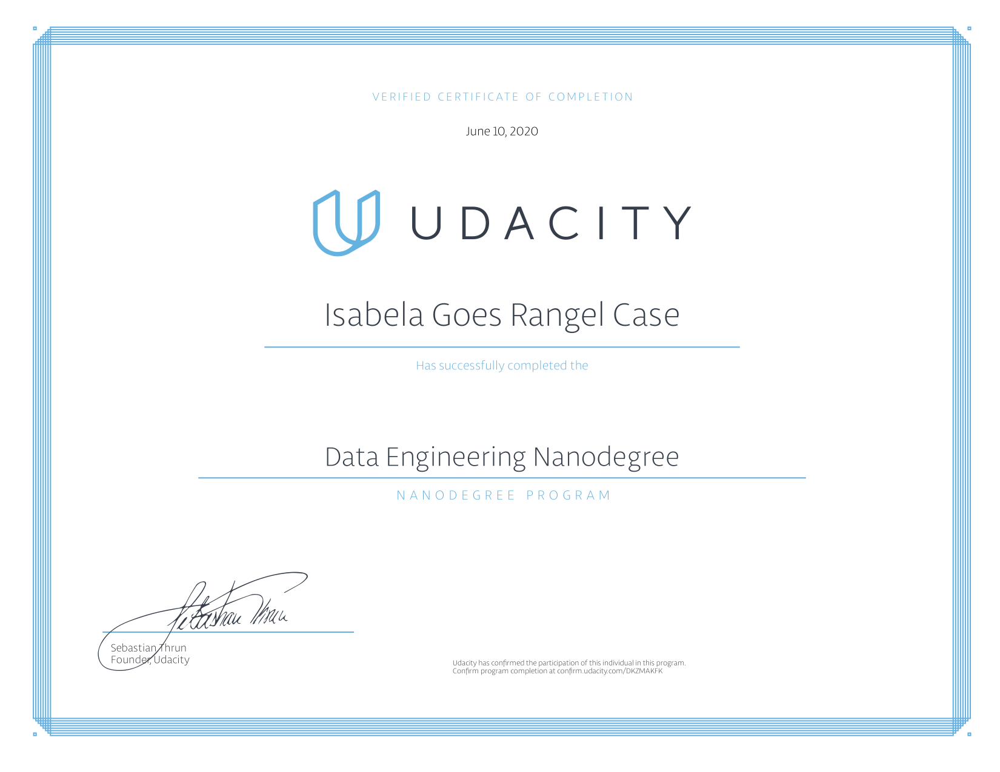

# Data Engineering Nanodegree
Collection of projects done during the course.

- **Project 1:** Data Modelling with Postgres

- **Project 2:** Data Warehouse with Redshift

- **Project 3:** Data Lake with Spark

- **Project 4:** Data Pipelines with Airflow

