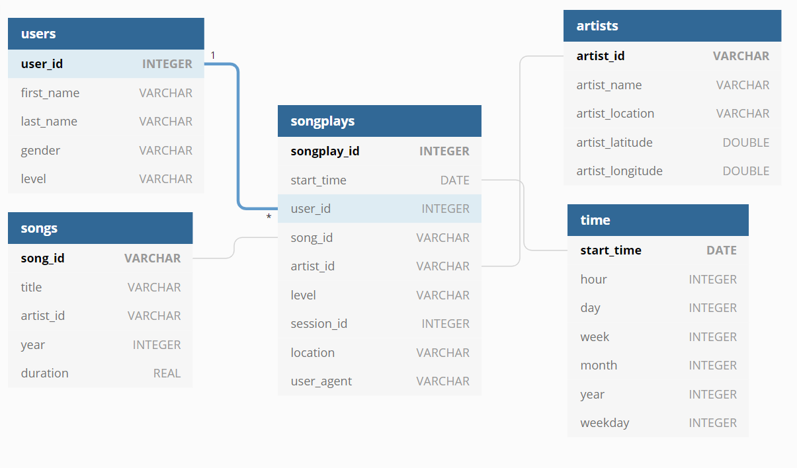

## Project: Data Modeling with Postgres


## Introduction
A startup called Sparkify wants to analyze the data they've been collecting on songs and user activity on their new music streaming app. The analytics team is particularly interested in understanding what songs users are listening to. Currently, they don't have an easy way to query their data, which resides in a directory of JSON logs on user activity on the app, as well as a directory with JSON metadata on the songs in their app. They'd like a data engineer to create a Postgres database with tables designed to optimize queries on song play analysis. **Your role is to create a database schema and ETL pipeline for this analysis**.

Define fact and dimension tables in a star schema for a particular analytic focus, write an ETL pipeline that transfers data from files in two local directories into these tables in Postgres using Python and SQL.


## Proposed schema


## Datasets
- **Songs dataset:** The first dataset is a subset of real data from the [Million Song Dataset](http://millionsongdataset.com/). Each file is in JSON format and contains metadata about a song and the artist of that song. The files are partitioned by the first three letters of each song's track ID. An entry of this dataset looks like:

```json
{"num_songs": 1, "artist_id": "ARJIE2Y1187B994AB7", "artist_latitude": null, "artist_longitude": null, "artist_location": "", "artist_name": "Line Renaud", "song_id": "SOUPIRU12A6D4FA1E1", "title": "Der Kleine Dompfaff", "duration": 152.92036, "year": 0}
```

- **Log dataset:** The second dataset consists of log files in JSON format generated by an [event simulator](https://github.com/Interana/eventsim) based on the songs in the dataset above. These simulate activity logs from a music streaming app based on specified configurations.

```json
{"artist":"Des'ree","auth":"Logged In","firstName":"Kaylee","gender":"F","itemInSession":1,"lastName":"Summers","length":246.30812,"level":"free","location":"Phoenix-Mesa-Scottsdale, AZ","method":"PUT","page":"NextSong","registration":1540344794796.0,"sessionId":139,"song":"You Gotta Be","status":200,"ts":1541106106796,"userAgent":"\"Mozilla\/5.0 (Windows NT 6.1; WOW64) AppleWebKit\/537.36 (KHTML, like Gecko) Chrome\/35.0.1916.153 Safari\/537.36\"","userId":"8"}
```

## Project Structure
- **conn_test.ipynb:** displays the first few rows of each table and check your database.

- **create_tables.py:** drops and creates the database tables. Run this file to reset the tables before running the ETL scripts.

- **etl.ipynb:** this notebook contains instructions on how the ETL process for each of the tables will be performed. Reads and processes a single file from song_data and log_data and loads the data into your tables. This file is used to create the ETL script in __etl.py__ file.

- **etl.py:** reads and processes files from song_data and log_data and loads them into your tables.

- **sql_queries.py:** contains all the sql queries to create/insert in the database.

## How to Run
- Run in the terminal:
```shell
$ python create_tables.py && python et.py
```
