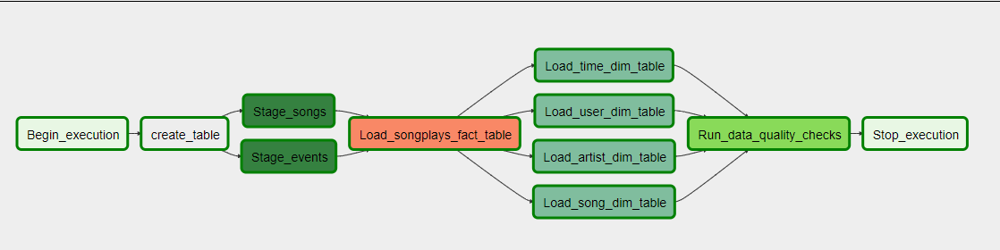

# Data Pipelines using Airflow

### Project structure
The project contains three major components for the project:

    - The dag template has all the imports and task templates in place, but the task dependencies have not been set

    - The operators folder with operator templates

    - A helper class for the SQL transformations

DAG requisites:


    - The DAG does not have dependencies on past runs

    - On failure, the task are retried 3 times

    - Retries happen every 5 minutes

    - Catchup is turned off

    - Do not email on retry


### Data source
- **Songs dataset:** The first dataset is a subset of real data from the [Million Song Dataset](http://millionsongdataset.com/). Each file is in JSON format and contains metadata about a song and the artist of that song. The files are partitioned by the first three letters of each song's track ID. An entry of this dataset looks like:

```json
{"num_songs": 1, "artist_id": "ARJIE2Y1187B994AB7", "artist_latitude": null, "artist_longitude": null, "artist_location": "", "artist_name": "Line Renaud", "song_id": "SOUPIRU12A6D4FA1E1", "title": "Der Kleine Dompfaff", "duration": 152.92036, "year": 0}
```

- **Log dataset:** The second dataset consists of log files in JSON format generated by an [event simulator](https://github.com/Interana/eventsim) based on the songs in the dataset above. These simulate activity logs from a music streaming app based on specified configurations.

```json
{"artist":"Des'ree","auth":"Logged In","firstName":"Kaylee","gender":"F","itemInSession":1,"lastName":"Summers","length":246.30812,"level":"free","location":"Phoenix-Mesa-Scottsdale, AZ","method":"PUT","page":"NextSong","registration":1540344794796.0,"sessionId":139,"song":"You Gotta Be","status":200,"ts":1541106106796,"userAgent":"\"Mozilla\/5.0 (Windows NT 6.1; WOW64) AppleWebKit\/537.36 (KHTML, like Gecko) Chrome\/35.0.1916.153 Safari\/537.36\"","userId":"8"}
```