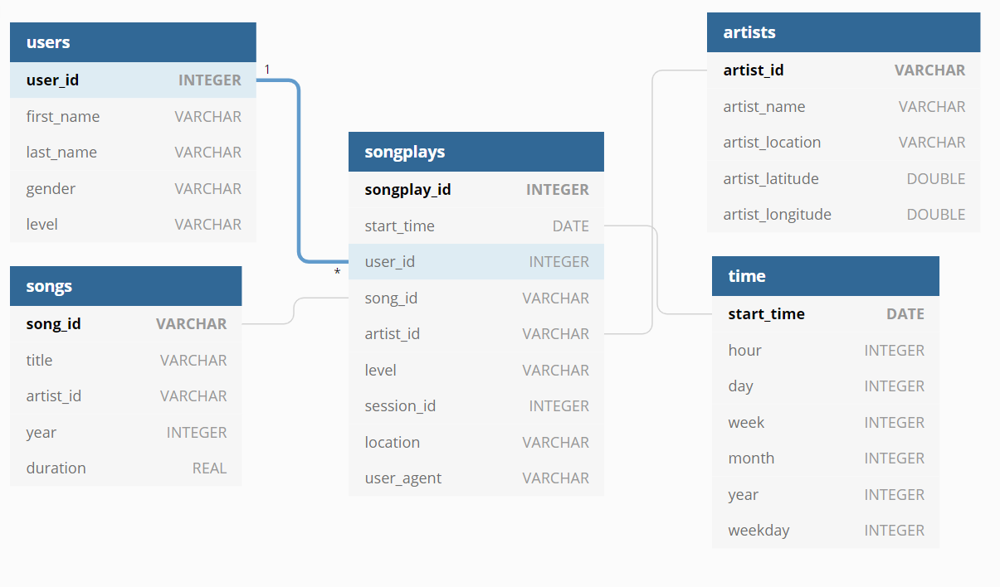

# Data Warehouse using AWS Redshift

The purpose of the project is to build a Data Warehouse using AWS Redshift. The data source are log files in an AWS S3 bucket. These log files will be processed and then a database following a Star Schema will be built. Finally, this database could be used to perform analytical queries or to connect to a BI Application

## Data source
- **Songs dataset:** The first dataset is a subset of real data from the [Million Song Dataset](http://millionsongdataset.com/). Each file is in JSON format and contains metadata about a song and the artist of that song. The files are partitioned by the first three letters of each song's track ID. An entry of this dataset looks like:

```json
{"num_songs": 1, "artist_id": "ARJIE2Y1187B994AB7", "artist_latitude": null, "artist_longitude": null, "artist_location": "", "artist_name": "Line Renaud", "song_id": "SOUPIRU12A6D4FA1E1", "title": "Der Kleine Dompfaff", "duration": 152.92036, "year": 0}
```

- **Log dataset:** The second dataset consists of log files in JSON format generated by an [event simulator](https://github.com/Interana/eventsim) based on the songs in the dataset above. These simulate activity logs from a music streaming app based on specified configurations.

```json
{"artist":"Des'ree","auth":"Logged In","firstName":"Kaylee","gender":"F","itemInSession":1,"lastName":"Summers","length":246.30812,"level":"free","location":"Phoenix-Mesa-Scottsdale, AZ","method":"PUT","page":"NextSong","registration":1540344794796.0,"sessionId":139,"song":"You Gotta Be","status":200,"ts":1541106106796,"userAgent":"\"Mozilla\/5.0 (Windows NT 6.1; WOW64) AppleWebKit\/537.36 (KHTML, like Gecko) Chrome\/35.0.1916.153 Safari\/537.36\"","userId":"8"}
```

## Description
The data is transferred from S3 to staging tables in the Redshift cluster. Then, data from the staging tables are loaded into the  final tables following the Star Schema below:


### Project Structure:

- **sql_queries.py:**
write SQL to: 
    - Create the Staging tables
    - Create fact and dimensions tables optimized following [AWS documentation](https://docs.aws.amazon.com/redshift/latest/dg/c_best-practices-best-dist-key.html)
    - Create statement to move data from S3 to Redshift cluster (Using the COPY command)
    - Create DROP statements
    
- **aws-setup.ipynb:** manage AWS Resources (IAM Role, S3 and Redshift cluster)

- **dwh.cfg:** config file

- **create_tables.py:**  script to create/drop table queries.

### How to run

Create the AWS resources using the aws-setup.ipynb, fill the config file and run the following commands in a terminal:

```
python create_tables.py && python etl.py
```